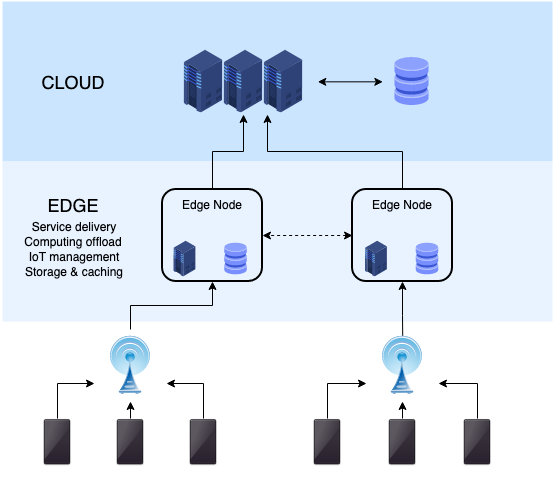

## Study about Edge Computing - Cloudflare Workers

> Edge computing is a distributed information technology (IT) architecture in which client data is processed at the periphery of the network, as close to the originating source as possible.

**How does edge computing work?**  
* Edge computing is all a matter of location. In traditional enterprise computing, data is produced at a client endpoint, such as a user's computer. That data is moved across a WAN such as the internet, through the corporate LAN, where the data is stored and worked upon by an enterprise application. Results of that work are then conveyed back to the client endpoint. This remains a proven and time-tested approach to client-server computing for most typical business applications.

---
### using:
* [Cloudflare Workers](https://workers.cloudflare.com)
* DB: 

REFs:
* [Article - What is edge computing? Everything you need to know](https://www.techtarget.com/searchdatacenter/definition/edge-computing)
* [YouTube - EDGE COMPUTING and why I'm studying it](https://www.youtube.com/watch?v=dcFoLL8Po_o)
